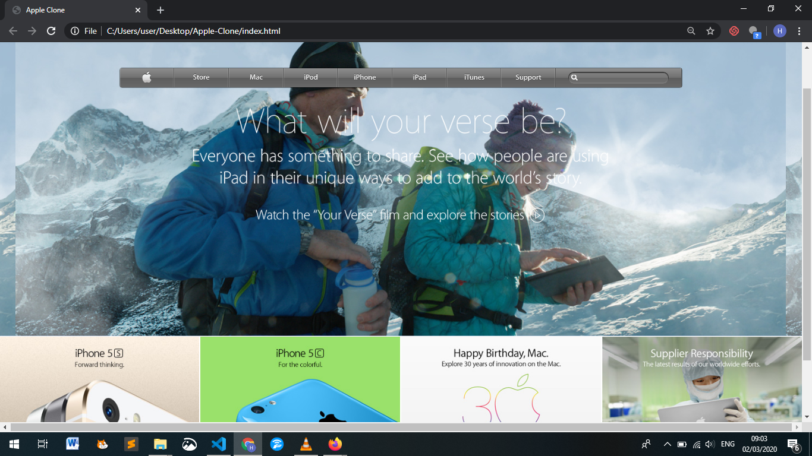

# Apple-Clone

> This project consists of building an HTML document that matches the appearance of mint.com’s signup page

> 

## Built With

- HTML &
- CSS

## Live Demo

[Live Demo Link](https://raw.githack.com/Hermela-Fikre/Apple-Clone/tree/feature_branch)

## Getting Started

To get a local copy up and running follow these simple example steps.

### Prerequisites

A browser of your choice preferrably Chrome.

### Setup

Fork this project to your local machine

## Author

👤 **Hermela Fikre**

- Github: [@Hermela-Fikre](https://github.com/Hermela-Fikre)
- Twitter: [@Hermela86529600](https://twitter.com/Hermela86529600)
- Linkedin: [hermela-fikre](https://www.linkedin.com/in/hermela-fikre-1a969b156/)

Contributions, issues and feature requests are welcome!

Feel free to check the [https://github.com/Hermela-Fikre/Apple-Clone/issues](issues/).

## Show your support

Give a ⭐️ if you like this project!

## Acknowledgments

- Font Awesome Library (https://www.w3schools.com/icons/fontawesome_icons_intro.asp)
- The Different Ways to Start Project using Floats, Flexbox, and Grid CSS by Ruben Paz Chuspe (https://hackernoon.com/the-different-ways-to-start-project-using-floats-flexbox-and-grid-css-4x82371n)
- Building Forms-Learn to Code (https://learn.shayhowe.com/html-css/building-forms/)